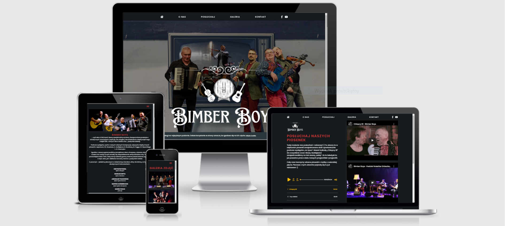
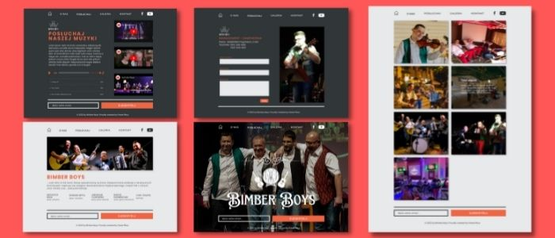

# Bimber Boys Band Official Web Page

See the [demo version](https://bimberboys-official.vercel.app/) deployed to [Vercel](https://vercel.com/). You can check the live production version at [Bimber Boys Official](https://bimberboys.pl).

The project is a semi-commercial realisation of a successful cooperation with one of the coolest local folk cover bands in Poland. It is a statically generated landing page written in Next.js, typed with Typescript and styled using Sass with CSS modules.

**Main features**:

- subscribing to the newsletter by typing in an email address.
- user can see the gallery of images with their descriptions on hover/tap.
- user can listen to the band's music samples using a custom audio player
- user can watch the band's video clips using a Youtube player
- sending a message using the contact form

## 💡 Technologies


## 💿 Installation

The project uses [node ver16.13.0](https://nodejs.org/en/) and [npm ver8.1.0](https://www.npmjs.com/).

1. `git fork`
2. `git clone` your repo.
3. `cd` into project root directory
4. `npm i`

Then, you can run:

#### `npm run dev`

Runs the app in the development mode.\
Open [http://localhost:3000](http://localhost:3000) to view it in the browser.

The page will reload if you make edits.\
You will also see any lint errors in the console.

## 🤔 Solutions provided in the project

- Mock pages were designed using Figma prototyping tool:
  &nbsp;
  
  &nbsp;

- Logo created in [Canva.com](https://canva.com)
- I built a custom audio player using React hooks: `useRef`, `useState` and `useEffect`, which were used to wire up the HTML `audio` Element. The global player state (the current audio track and setters for previous and next track) was based on Context API, and `useContext` hook.
- All images are served locally and wrapped in the Next.js's `<Image>` Component, which accounted for an automatic image resize and optimisation, as described in the documentation: [Image Component and Image Optimization](https://nextjs.org/docs/basic-features/image-optimization)
- The icons used in this project come from [fontawsome.com](https://fontawesome.com/)
- The subscription feature is built using a custom integration with [Mailchimp](https://mailchimp.com/) marketing tool via adopting Mailchimp's contact form
- All forms are developed with the use of [React Hook Form](https://react-hook-form.com/), with custom error and loading state handlers and form submission.
- Animated logo used at home page was developed using [Framer Motion](https://www.framer.com/motion/) library.
- For securing the forms I used [Botpoison](https://botpoison.com/) spam prevention tool, which combines `Hashcash` cryptographic hash-based proof-of-work algorithm, IP reputation checks and sessions and request analyses. No more captcha riddles!

## 💭 Conclusions

#### Styling Next.js's `<Image>` component

As described in [documentation](https://nextjs.org/docs/basic-features/image-optimization#styling), Next.js wrapper on `img` HTML element has a specific structure you need to take into consideration when applying styles, which may not be as straightforward as it is with simple `img`.
As Peter Lunch nicely explains, the Nextjs Image component nests `img` into couple of other containers. In his [blog post](https://www.peterlunch.com/snippets/next-image-styling), he talks about `div`, but I've got my `img` wrapped into `span`s. So, styling was possible by wrapping `<Image>` into a `div` and then using:

```css
.img_wrapper > span {
  box-shadow: $base-box-shadow;
}
```

Also useful, there's an in-depth explanation on why and how from the creators of the `<Image>` component posted [here](https://web.dev/image-component/).

#### Building and styling a custom audio player in React.js

Now, this was fun... When it comes to styling an audio player and account for different web browsers out there, it is a mess...
Just have a look at one of the CSS classes I used:

```CSS
.progressBar {
  --bar-before-width: 0;
  background: $bar-bg;
  appearance: none;
  border-radius: 5px;
  position: relative;
  width: 100%;
  height: 2px;
  outline: none;
}

// progressbar -firefox
.progressBar::moz-range-track {
  background: $bar-bg;
  appearance: none;
  border-radius: 5px;
  position: relative;
  width: 100%;
  height: 2px;
  outline: none;
}

.progressBar::-moz-focus-outer {
  border: 0;
}
```

...and it goes on and on with every single piece of the player: from the progressbar through the slider thumb (in Chrome and Safari) or range thumb(in Firefox). Phew...

Now, in implementation of the player logic, there's a bit of a problem with `useEffect` hook, which should update the progress bar on every change of `currentTrackMoment` (every second that is), except that it doesn't. Due to re-render optimisation algorithms of React, `useEffect` updates state asynchronously which makes it useless in this particular scenario. Hence, `requestAnimationFrame()` method was used to update the progress bar on every change of the `currentTrackMoment`.

```JS
const handlePlay = () => {
    const prevValue = isPlaying;
    setIsPlaying(!prevValue);
    if (audioPlayer.current) {
      if (!prevValue) {
        audioPlayer.current.play();
        animationRef.current = requestAnimationFrame(whilePlaying);
      } else {
        audioPlayer.current.pause();
        cancelAnimationFrame(animationRef.current);
      }
    }
  };
```

#### Mailchimp integration

I used [Mailchimp](https://mailchimp.com/) for the subscribe feature. It handles a lot more than just collecting emails and sending them every day to your inbox. Yet, the popularity and ease of use made me take that shot. Well, as it turned out it wasn't so easy to query Mailchimp API to handle my subscribe input field, so I reached for `react-mailchimp-subscribe` npm package, which did the heavy part.
All I needed was to get the embedded form from Mailchimp and submit the data in the form of a proper object.

```js
const onSubmit: SubmitHandler<ISubscribeInputs> = (data) => {
  data.email &&
    onValidated({
      MERGE0: data.email,
    });
  reset();
  setisChecked(false);
};
```

As described in this nice [blog post](https://dev.to/gedalyakrycer/create-an-email-list-with-react-mailchimp-965) by Gedalya Krycer.

## 🙋‍♂️ Feel free to contact me

LinkedIn - [/in/pawel-pikus](https://www.linkedin.com/in/pawel-pikus/)

## 👏 Thanks / Special thanks / Credits

Thanks to [dribbble.com](https://dribbble.com/) for inspiration on UI design.
Thanks to [devmentor.pl](https://devmentor.pl/) - for a cool Readme.md template.
