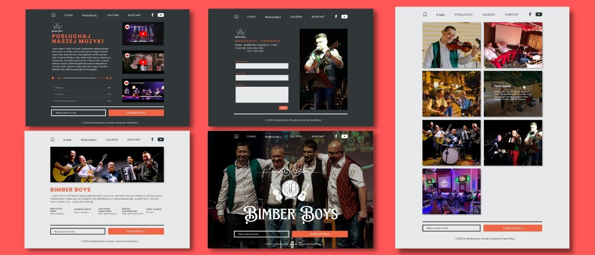

# Bimber Boys Band Official Web Page

See the [demo version](https://bimberboys-official.vercel.app/) deployed to [Vercel](https://vercel.com/). You can check the live production version at [Bimber Boys Official](https://bimberboys.pl).

The project is a semi-commercial realisation of a successful cooperation with one of the coolest local folk cover bands in Poland. It is a statically generated landing page written in Next.js, typed with Typescript and styled using Sass with CSS modules.

**Main features**:

- subscribing to the newsletter by typing in an email address.
- user can see the gallery of images with their descriptions on hover/tap.
- user can listen to the band's music samples using a custom audio player
- user can watch the band's video clips using a Youtube player
- sending a message using the contact form

&nbsp;

## 💡 Technologies

&nbsp;

## 💿 Installation

The project uses [node ver16.13.0](https://nodejs.org/en/) and [npm ver8.1.0](https://www.npmjs.com/).

1. `git fork`
2. `git clone` your repo.
3. `cd` into project root directory
4. `npm i`

Then, you can run:

#### `npm run dev`

Runs the app in the development mode.\
Open [http://localhost:3000](http://localhost:3000) to view it in the browser.

The page will reload if you make edits.\
You will also see any lint errors in the console.

&nbsp;

## 🤔 Solutions provided in the project

- mock pages were designed using Figma prototyping tool:
  &nbsp;
  
  &nbsp;

- logo created in [Canva.com](https://canva.com)
- I built a custom audio player using React hooks: `useRef`, `useState` and `useEffect`, which were used to wire up the HTML `audio` Element. The global player state (the current audio track and setters for previous and next track) was based on Context API, and `useContext` hook.
- all images are served locally and wrapped in the Next.js's `<Image>` Component, which accounted for an automatic image resize and optimisation, as described in the documentation: [Image Component and Image Optimization](https://nextjs.org/docs/basic-features/image-optimization)
- the icons used in this project come from [fontawsome.com](https://fontawesome.com/)
- the subscription feature is built using a custom integration with [Mailchimp](https://mailchimp.com/) marketing tool via adopting Mailchimp's contact form
- all forms are developed with the use of [React Hook Form](https://react-hook-form.com/), with custom error and loading state handlers and form submission.
- animated logo used at home page was developed using [Framer Motion](https://www.framer.com/motion/) library.
- For securing the forms I used [Botpoison](https://botpoison.com/) spam prevention tool, which combines `Hashcash` cryptographic hash-based proof-of-work algorithm, IP reputation checks and sessions and request analyses. No more captcha riddles!

## 💭 Conclusions

## 🙋‍♂️ Feel free to contact me

LinkedIn - [/in/pawel-pikus](https://www.linkedin.com/in/pawel-pikus/)

&nbsp;

## 👏 Thanks / Special thanks / Credits

Thanks to [dribbble.com](https://dribbble.com/) for inspiration on UI design.
Thanks to [devmentor.pl](https://devmentor.pl/) - for a cool Readme.md template.
